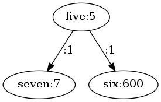

<center><font size=72>
<br> Design in C++ 
<br> HW4 : Graph Library
<br> Yogesh Garg (yg2482)
</font></center>

# Implementations

 * Adjacency_matrix : This is well suited for any arbitrary Directed Graph
 * Node_graph : This is well suited for a Directed Acyclic Graph, although cycles may be seen in the graph,
it is possible to detect those and not add edges that do introduce these. Such an option is provided in the
interface, but for this document, we allowed cycles to see  what happens on removal of nodes etc.
 * Node_tree : Here, a pointer to the parent is maintained, and this can be seen as "who is the owner".
Once an owner is fixed, we never change it, this is why we are unable to add cycles and multiple parents
as seen in the error log.

# No Memory Leak
 * Adjacency_matrix : References are stored in adjacency matrix which behaves well on removal of nodes
 * Node_graph and Node_tree : All references are cleared and a list of vertices is maintained, which is
 cleared at destruction, this ensures no node that is abandoned by deletion is forgotten to be cleared.


# Removing Nodes
<table>
<tr><th>Graph Type<th>All edges<th>After removing nodes 1, 3
<tr><td>Adjacency_matrix<td> <td>
<tr><td>Node_graph <td> <td>
<tr><td>Node_tree <td> <td>
</table>


# Functions implemented

All the functions have been implemented, as seen in ```graph.h```
Note that values can be changed directly from the ```Edge_ptr``` and ```Node_ptr```
types, and thus set and get value have not been introduced in the api.

## Test Results on Adjacency_matrix

```
# testing graph Adjacency_matrix
# value of v0x5abc220 [label="six:6"]; is [label="six:6"]
# value of v0x5abc220 [label="six:600"]; is [label="six:600"]
# value of v0x5abbfa0 -> v0x5abc0a0 [label="myedge:2"]; is [label="myedge:2"]
# top element is: v0x5abbfa0 [label="foo:1"];
# neighbors of v0x5abc0a0 [label="baz:3"]; are: 2
# number of vertices not reachable form this are: 1
# number of vertices not reachable form v0x5abc220 [label="six:600"]; are: 1
# number of vertices not reachable form v0x5abc2a0 [label="seven:7"]; are: 6
# number of vertices not reachable form v0x5abc0a0 [label="baz:3"]; are: 1
# is this graph fully reachable?: 0
# is this graph fully reachable from v0x5abc2a0 [label="seven:7"];?: 0
# top element is: v0x5abbfa0 [label="foo:1"];
# is there a cycle?: 1
# is there a cycle from v0x5abc120 [label="four:4"];?: 0
# are v0x5abc1a0 [label="five:5"]; and v0x5abc220 [label="six:600"]; adjacent? : 1
# are v0x5abc1a0 [label="five:5"]; and v0x5abbfa0 [label="foo:1"]; adjacent? : 0
# sorted vertices:
#	[label="foo:1"]
#	[label="bar:2"]
#	[label="baz:3"]
#	[label="four:4"]
#	[label="five:5"]
#	[label="seven:7"]
#	[label="six:600"]
# sorted edges:
#	[label=":1"]
#	[label=":1"]
#	[label=":1"]
#	[label=":1"]
#	[label=":1"]
#	[label=":1"]
#	[label=":1"]
#	[label="myedge:2"]
```

## Test Results on Node_graph

```
# testing graph Node_graph
# value of v0x5ad22f0 [label="six:6"]; is [label="six:6"]
# value of v0x5ad22f0 [label="six:600"]; is [label="six:600"]
# value of v0x5ad2070 -> v0x5ad2170 [label="myedge:2"]; is [label="myedge:2"]
# top element is: v0x5ad2070 [label="foo:1"];
# neighbors of v0x5ad2170 [label="baz:3"]; are: 2
# number of vertices not reachable form this are: 0
# number of vertices not reachable form v0x5ad22f0 [label="six:600"]; are: 0
# number of vertices not reachable form v0x5ad2370 [label="seven:7"]; are: 5
# number of vertices not reachable form v0x5ad2170 [label="baz:3"]; are: 0
# is this graph fully reachable?: 1
# is this graph fully reachable from v0x5ad2370 [label="seven:7"];?: 0
# top element is: v0x5ad2070 [label="foo:1"];
# is there a cycle?: 1
# is there a cycle from v0x5ad21f0 [label="four:4"];?: 0
# are v0x5ad2270 [label="five:5"]; and v0x5ad22f0 [label="six:600"]; adjacent? : 1
# are v0x5ad2270 [label="five:5"]; and v0x5ad2070 [label="foo:1"]; adjacent? : 0
# sorted vertices:
#	[label="foo:1"]
#	[label="bar:2"]
#	[label="baz:3"]
#	[label="five:5"]
#	[label="seven:7"]
#	[label="six:600"]
# sorted edges:
```

## Test Results on Node_tree

```
# testing graph Node_tree
# caught exception Can not make this edge in a tree.
# caught exception Can not make this edge in a tree.
# caught exception Can not make this edge in a tree.
# value of v0x5ae8d30 [label="six:6"]; is [label="six:6"]
# value of v0x5ae8d30 [label="six:600"]; is [label="six:600"]
# value of v0x5ae8ab0 -> v0x5ae8bb0 [label="myedge:2"]; is [label="myedge:2"]
# top element is: v0x5ae8ab0 [label="foo:1"];
# neighbors of v0x5ae8bb0 [label="baz:3"]; are: 1
# number of vertices not reachable form this are: 0
# number of vertices not reachable form v0x5ae8d30 [label="six:600"]; are: 4
# number of vertices not reachable form v0x5ae8db0 [label="seven:7"]; are: 5
# number of vertices not reachable form v0x5ae8bb0 [label="baz:3"]; are: 3
# is this graph fully reachable?: 1
# is this graph fully reachable from v0x5ae8db0 [label="seven:7"];?: 0
# top element is: v0x5ae8ab0 [label="foo:1"];
# is there a cycle?: 0
# is there a cycle from v0x5ae8c30 [label="four:4"];?: 0
# are v0x5ae8cb0 [label="five:5"]; and v0x5ae8d30 [label="six:600"]; adjacent? : 1
# are v0x5ae8cb0 [label="five:5"]; and v0x5ae8ab0 [label="foo:1"]; adjacent? : 0
# sorted vertices:
#	[label="foo:1"]
#	[label="bar:2"]
#	[label="baz:3"]
#	[label="five:5"]
#	[label="six:600"]
# sorted edges:
```

